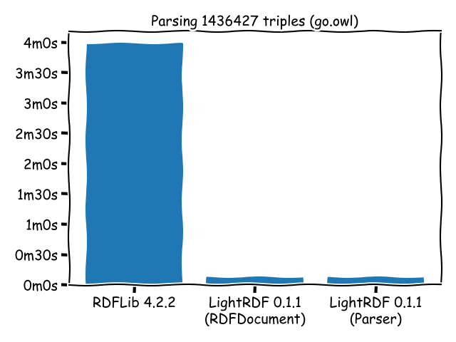

# LightRDF

[](https://github.com/ozekik/lightrdf/actions)
[](https://pypi.python.org/pypi/lightrdf/)
[](https://pypistats.org/packages/lightrdf)

A fast and lightweight Python RDF parser which wraps bindings to Rust's [Rio](https://github.com/Tpt/rio) using [PyO3](https://github.com/PyO3/pyo3).

## Features

- Supports N-Triples, Turtle, and RDF/XML
- Handles large-size RDF documents
- Provides HDT-like interfaces

## Install

```
pip install lightrdf
```

## Usage

#### Iterate over all triples (Parser)

```python
import lightrdf

parser = lightrdf.Parser()  # or lightrdf.xml.Parser() for xml

for triple in parser.parse("./go.owl", base_iri=None):
    print(triple)
```

#### Iterate over all triples (HDT-like)

```python
import lightrdf

doc = lightrdf.RDFDocument("./go.owl")
# ...or lightrdf.RDFDocument("./go.owl", base_iri="", parser=lightrdf.xml.PatternParser) for xml

# `None` matches arbitrary term
for triple in doc.search_triples(None, None, None):
    print(triple)
```

#### Triple pattern (HDT-like)

```python
import lightrdf

doc = lightrdf.RDFDocument("./go.owl")

for triple in doc.search_triples("http://purl.obolibrary.org/obo/GO_0005840", None, None):
    print(triple)

# Output:
# ('http://purl.obolibrary.org/obo/GO_0005840', 'http://www.w3.org/1999/02/22-rdf-syntax-ns#type', 'http://www.w3.org/2002/07/owl#Class')
# ('http://purl.obolibrary.org/obo/GO_0005840', 'http://www.w3.org/2000/01/rdf-schema#subClassOf', 'http://purl.obolibrary.org/obo/GO_0043232')
# ...
# ('http://purl.obolibrary.org/obo/GO_0005840', 'http://www.geneontology.org/formats/oboInOwl#inSubset', 'http://purl.obolibrary.org/obo/go#goslim_yeast')
# ('http://purl.obolibrary.org/obo/GO_0005840', 'http://www.w3.org/2000/01/rdf-schema#label', '"ribosome"^^<http://www.w3.org/2001/XMLSchema#string>')
```

#### Tip: Open file in Python (Parser)

```python
import lightrdf

parser = lightrdf.Parser()

with open("./go.owl", "rb") as f:
    for triple in parser.parse(f, format="owl", base_iri=None):
        print(triple)
```

```python
import lightrdf

parser = lightrdf.xml.Parser()

with open("./go.owl", "rb") as f:
    for triple in parser.parse(f, base_iri=None):
        print(triple)
```

#### Tip: Open file in Python (HDT-like)

```python
import lightrdf

with open("./go.owl", "rb") as f:
    doc = lightrdf.RDFDocument(f, parser=lightrdf.xml.PatternParser)

    for triple in doc.search_triples("http://purl.obolibrary.org/obo/GO_0005840", None, None):
        print(triple)
```

#### Tip: Parse from string

```python
import io
import lightrdf

data = """<http://one.example/subject1> <http://one.example/predicate1> <http://one.example/object1> . # comments here
# or on a line by themselves
_:subject1 <http://an.example/predicate1> "object1" .
_:subject2 <http://an.example/predicate2> "object2" ."""

doc = lightrdf.RDFDocument(io.BytesIO(data.encode()), parser=lightrdf.turtle.PatternParser)

for triple in doc.search_triples("http://one.example/subject1", None, None):
    print(triple)
```

## Benchmark (WIP)

> On MacBook Air (13-inch, 2017), 1.8 GHz Intel Core i5, 8 GB 1600 MHz DDR3

<https://gist.github.com/ozekik/b2ae3be0fcaa59670d4dd4759cdffbed>

```bash
$ wget -q http://purl.obolibrary.org/obo/go.owl
$ gtime python3 count_triples_rdflib_graph.py ./go.owl  # RDFLib 4.2.2
1436427
235.29user 2.30system 3:59.56elapsed 99%CPU (0avgtext+0avgdata 1055816maxresident)k
0inputs+0outputs (283major+347896minor)pagefaults 0swaps
$ gtime python3 count_triples_lightrdf_rdfdocument.py ./go.owl  # LightRDF 0.1.1
1436427
7.90user 0.22system 0:08.27elapsed 98%CPU (0avgtext+0avgdata 163760maxresident)k
0inputs+0outputs (106major+41389minor)pagefaults 0swaps
$ gtime python3 count_triples_lightrdf_parser.py ./go.owl  # LightRDF 0.1.1
1436427
8.00user 0.24system 0:08.47elapsed 97%CPU (0avgtext+0avgdata 163748maxresident)k
0inputs+0outputs (106major+41388minor)pagefaults 0swaps
```

<p align="center">

</p>

<https://gist.github.com/ozekik/636a8fb521401070e02e010ce591fa92>

```bash
$ wget -q http://downloads.dbpedia.org/2016-10/dbpedia_2016-10.nt
$ gtime python3 count_triples_rdflib_ntparser.py dbpedia_2016-10.nt  # RDFLib 4.2.2
31050
1.63user 0.23system 0:02.47elapsed 75%CPU (0avgtext+0avgdata 26568maxresident)k
0inputs+0outputs (1140major+6118minor)pagefaults 0swaps
$ gtime python3 count_triples_lightrdf_ntparser.py dbpedia_2016-10.nt  # LightRDF 0.1.1
31050
0.21user 0.04system 0:00.36elapsed 71%CPU (0avgtext+0avgdata 7628maxresident)k
0inputs+0outputs (534major+1925minor)pagefaults 0swaps
```

<p align="center">

</p>

## Alternatives

- [RDFLib](https://github.com/RDFLib/rdflib) – (Pros) pure-Python, matured, feature-rich / (Cons) takes some time to load triples
- [pyHDT](https://github.com/Callidon/pyHDT) – (Pros) extremely fast and efficient / (Cons) requires pre-conversion into HDT

## Todo

- [x] Push to PyPI
- [x] Adopt CI
- [x] Handle Base IRI
- [x] Add basic tests
- [ ] Support NQuads and TriG
- [ ] Add docs
- [ ] Add tests for [w3c/rdf-tests](https://github.com/w3c/rdf-tests)
- [ ] Resume on error
- [x] Allow opening fp

## License

[Rio](https://github.com/Tpt/rio) and [PyO3](https://github.com/PyO3/pyo3) are licensed under the Apache-2.0 license.

    Copyright 2020 Kentaro Ozeki

    Licensed under the Apache License, Version 2.0 (the "License");
    you may not use this file except in compliance with the License.
    You may obtain a copy of the License at

        http://www.apache.org/licenses/LICENSE-2.0

    Unless required by applicable law or agreed to in writing, software
    distributed under the License is distributed on an "AS IS" BASIS,
    WITHOUT WARRANTIES OR CONDITIONS OF ANY KIND, either express or implied.
    See the License for the specific language governing permissions and
    limitations under the License.
